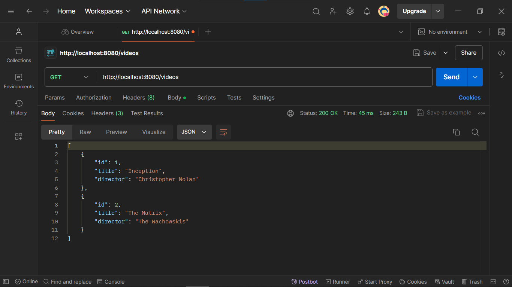
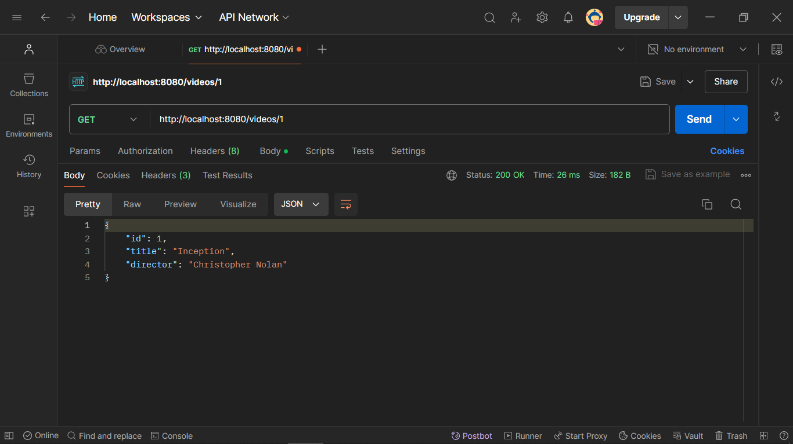
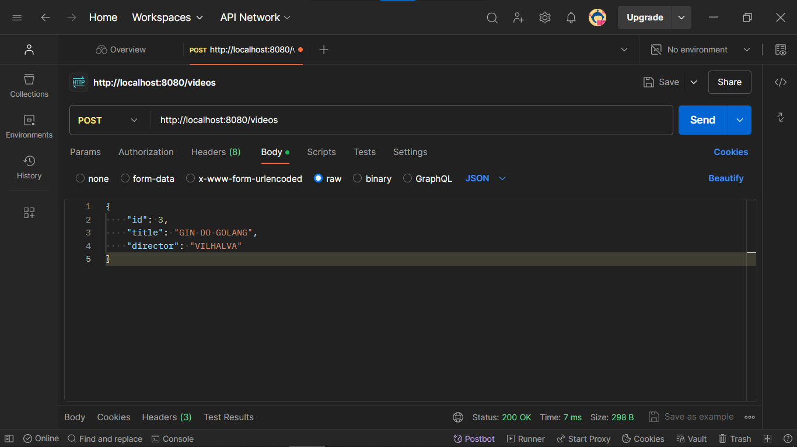
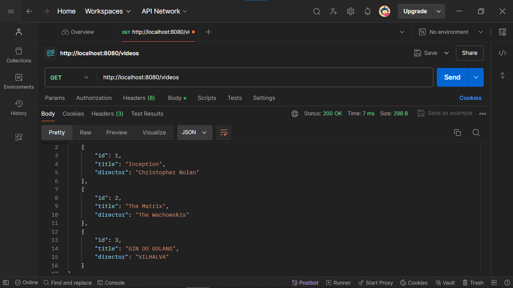
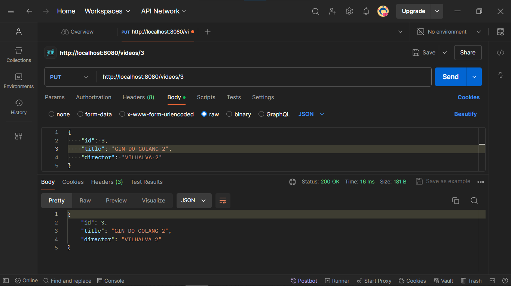
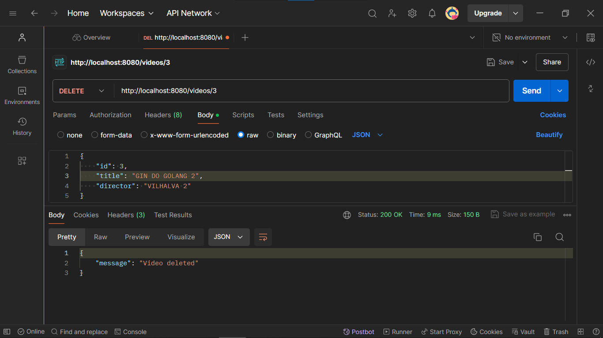

# SIMPLES API RESTFUL COM GIN
👨‍💻API RESTFUL COM OPERAÇÕES CRUD DE VIDEOS COM O FRAMEWORK GIN DO GOLANG!

 <br>
 <br>
 <br>
 <br>
 <br>
 <br>
 <br>
 <br>

## DESCRIÇÃO:
Este aplicativo é uma API RESTful desenvolvida em Go utilizando o framework Gin. A API permite gerenciar uma coleção de vídeos, oferecendo operações CRUD (Create, Read, Update, Delete). Ela é simples e fácil de usar, adequada para iniciantes que estão aprendendo sobre desenvolvimento de APIs com Go e Gin.

## FUNCIONALIDADES:
1. **Listar todos os vídeos**: Recupera uma lista de todos os vídeos cadastrados.
2. **Obter um vídeo pelo ID**: Recupera as informações de um vídeo específico através do seu ID.
3. **Criar um novo vídeo**: Adiciona um novo vídeo à coleção.
4. **Atualizar um vídeo existente**: Atualiza as informações de um vídeo existente na coleção.
5. **Deletar um vídeo**: Remove um vídeo específico da coleção.

## EXECUTANDO O PROJETO:
1. **Iniciar o Servidor**
   - Para iniciar o servidor, execute o arquivo em `./CODIGO/main.go` com um dos seguintes comandos no terminal:

   ```bash
   go run .
   ```

   ou
   ```bash
   go run main.go
   ```

2. **Testar a API**
   - Use ferramentas como Postman ou cURL para testar os endpoints.

   **Listar todos os vídeos**
   ```bash
   curl -X GET http://localhost:8080/videos
   ```

   **Obter um vídeo pelo ID**
   ```bash
   curl -X GET http://localhost:8080/videos/1
   ```

   **Criar um novo vídeo**
   ```bash
   curl -X POST http://localhost:8080/videos -d '{"title":"Interstellar","director":"Christopher Nolan"}' -H "Content-Type: application/json"
   ```

   **Atualizar um vídeo existente**
   ```bash
   curl -X PUT http://localhost:8080/videos/1 -d '{"title":"Inception Updated","director":"Christopher Nolan"}' -H "Content-Type: application/json"
   ```

   **Deletar um vídeo**
   ```bash
   curl -X DELETE http://localhost:8080/videos/1
   ```

## NÃO SABE?
- Entendemos que para manipular arquivos em muitas linguagens e tecnologias, é necessário possuir conhecimento nessas áreas. Para auxiliar nesse aprendizado, oferecemos alguns subsidios:
* [CURSO DE GIN](https://github.com/VILHALVA/CURSO-DE-GIN)
* [CONFIRA MAIS CURSOS](https://github.com/VILHALVA?tab=repositories&q=+topic:CURSO)

## CREDITOS:
- [PROJETO CRIADO PELO VILHALVA](https://github.com/VILHALVA)

